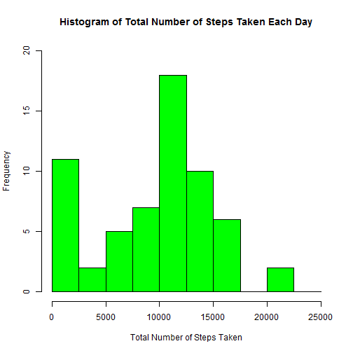
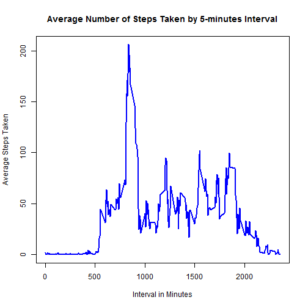
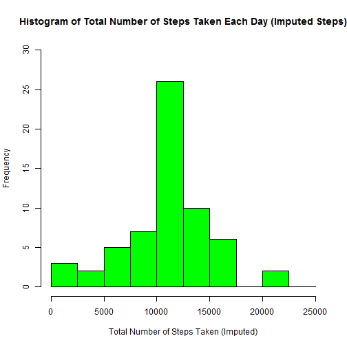
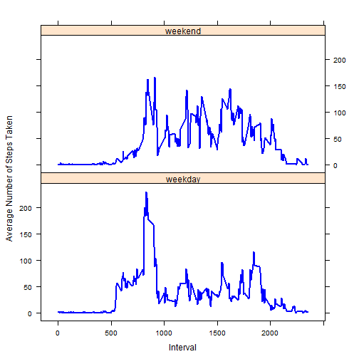

#Coursera Data Science Reproducible Research: Peer Assessment 1

This is R Mark Down document for Peer Assessment 1 in Coursera course, Reproducible Research offered by John Hopkins Bloomberg School of Public Health.

This assignment uses data from a personal activity monitory device that collects data at 5 minutes interval throughout the day. The data consists of anonymously collected activity during October and November 2012. It includes the number of steps taken in 5 minute intervals of each day.

##Loading and Pre-processing the Data

Data is loaded by first unzipping the data and read the csv it contained.


```r
# Data is loaded using read.csv() and unz() functions
activity <- read.csv(unz('activity.zip','activity.csv'),stringsAsFactors= F)

# Summary of the current dataset.
summary(activity)
```

```
##      steps            date              interval     
##  Min.   :  0.00   Length:17568       Min.   :   0.0  
##  1st Qu.:  0.00   Class :character   1st Qu.: 588.8  
##  Median :  0.00   Mode  :character   Median :1177.5  
##  Mean   : 37.38                      Mean   :1177.5  
##  3rd Qu.: 12.00                      3rd Qu.:1766.2  
##  Max.   :806.00                      Max.   :2355.0  
##  NA's   :2304
```


Summary of the data shows types of data contained:

* steps: Number of steps taking in a 5-minute interval and missing values are coded as NA
* date: The date on which the measurement was taking in YYYY-MM-DD format
* interval: Identified for the 5-minute interval in which measurement was taken.

The dataset is then transformed into a format suitable for analysis.
Transformation performed are:

1. Convert the date variable from string to date.
3. Create new variable in the dataset indicating whether the date is weekday or weekend.


```r
# Convert date variable to date attribute.
activity$date <- as.Date(activity$date,format="%Y-%m-%d")

# Create new variable with two levels to indicate weekday or weekend.
activity$day <- as.factor(ifelse(
                        weekdays(activity$date) == 'Saturday' | weekdays(activity$date) == 'Sunday'
                        ,'weekend','weekday'))

# Summary of transformed dataset.
summary(activity)
```

```
##      steps             date               interval           day       
##  Min.   :  0.00   Min.   :2012-10-01   Min.   :   0.0   weekday:12960  
##  1st Qu.:  0.00   1st Qu.:2012-10-16   1st Qu.: 588.8   weekend: 4608  
##  Median :  0.00   Median :2012-10-31   Median :1177.5                  
##  Mean   : 37.38   Mean   :2012-10-31   Mean   :1177.5                  
##  3rd Qu.: 12.00   3rd Qu.:2012-11-15   3rd Qu.:1766.2                  
##  Max.   :806.00   Max.   :2012-11-30   Max.   :2355.0                  
##  NA's   :2304
```

The date is transformed whereas the new variable created contains two levels of value to indicate weekday or weekend of the particular date.

## Total Number of Steps Taken per Day
This section will analyse the total number of steps taken per day.

*Note: NA value are removed from the aggregation.*


```r
# Number of steps are aggregated by date
activity_sum_day <- aggregate(activity$steps, by= list(activity$date), FUN= sum, na.rm= TRUE)

# Change the variables name to make it more convenient to use.
names(activity_sum_day) <-c('date','total')

# Summary of the aggregated dataset.
summary(activity_sum_day)
```

```
##       date                total      
##  Min.   :2012-10-01   Min.   :    0  
##  1st Qu.:2012-10-16   1st Qu.: 6778  
##  Median :2012-10-31   Median :10395  
##  Mean   :2012-10-31   Mean   : 9354  
##  3rd Qu.:2012-11-15   3rd Qu.:12811  
##  Max.   :2012-11-30   Max.   :21194
```
The summary shows the data contain in the aggregated dataset.

Histogram showing the distribution of steps over the two months period.

```r
# Create histogram for the aggregated dataset.
hist(activity_sum_day$total,
     breaks= seq(0,25000,2500),
     ylim= c(0,20),
     col= 'green',
     xlab= "Total Number of Steps Taken",
     main= 'Histogram of Total Number of Steps Taken Each Day'
     )
```

 

The mean and median of the total number of steps taken per day are calculated using the following functions.


```r
# Calculate the mean and round it to nearest two decimal points.
mean(activity_sum_day$total)

# Calculate te median.
median(activity_sum_day$total)
```

The mean and median of the total number of steps taken per day are **9354.23** and **10395.00** respectively.

## Average Daily Activity Pattern
This section will analyse the average daily activity pattern.

*Note: NA value are removed from the computation.*


```r
# Number of steps are average across interval.
activity_avg_interval <- aggregate(activity$steps, by= list(activity$interval), FUN= mean, na.rm= TRUE)

# Change the variables name to make it more convenient to use.
names(activity_avg_interval) <-c('interval','average')

# Summary of the aggregated dataset.
summary(activity_avg_interval)
```

```
##     interval         average       
##  Min.   :   0.0   Min.   :  0.000  
##  1st Qu.: 588.8   1st Qu.:  2.486  
##  Median :1177.5   Median : 34.113  
##  Mean   :1177.5   Mean   : 37.383  
##  3rd Qu.:1766.2   3rd Qu.: 52.835  
##  Max.   :2355.0   Max.   :206.170
```

The summary shows the interval at 5-minute and the average steps taken at the particular interval.

A time-series plot of the 5-minute interval and the average number of steps taken, average across all days.


```r
# Plot line graph for average daily steps taken.
plot(activity_avg_interval$interval,activity_avg_interval$average,
     type='l',
     col='blue',
     lwd=2,
     xlab = 'Interval in Minutes',
     ylab = 'Average Steps Taken',
     main = 'Average Number of Steps Taken by 5-minutes Interval'
     )
```

 

The 5-minutes interval that contains the maximum average number of steps are computed.

```r
activity_avg_interval$interval[
        which(activity_avg_interval$average== max(activity_avg_interval$average))
        ] 
```

The 5-minutes interval that contains the maximum average number of steps is **835** with an average steps taken of **206.17**.

##Imputing Missing Values
This section will analyse the mising values contained in the dataset and replace it with mean for the interval across all day.

The total number of missing values contained in the dataset are calculated.


```r
sum(is.na(activity$steps))
```

```
## [1] 2304
```

The total number of rows with NA is **2304**.

NA values are replaced using the average steps taken across all days at the particular 5-minutes interval.

*Note: Dataset created in the previous section, the average number of steps taken across all days by intervals are used to impute the NA.*


```r
# Original dataset are split to two dataset where steps variable 
# contain non-NA value and NA values respectively.
activity_non_na <- activity[!is.na(activity$steps),]
activity_na <- activity[is.na(activity$steps),]

# NA value in the activity_na are replaced with the average steps taken by interval across all days.
activity_na_imputed <- merge(activity_na,
                          activity_avg_interval,
                          by= 'interval',
                          all.x= T)

# Remove original 'steps' variable and rearrange the columns position to the original dataset.
# Rename imputed variable to 'steps'
activity_na_imputed <- activity_na_imputed[,c(5,3,1,4)]
colnames(activity_na_imputed)[1] <- 'steps'

# Union the original dataset contain with no NA values at its steps variable with the imputed datset.
activity_imputed <- rbind(activity_non_na,activity_na_imputed)

# Summary of the imputed dataset.
summary(activity_imputed)
```

```
##      steps             date               interval           day       
##  Min.   :  0.00   Min.   :2012-10-01   Min.   :   0.0   weekday:12960  
##  1st Qu.:  0.00   1st Qu.:2012-10-16   1st Qu.: 588.8   weekend: 4608  
##  Median :  0.00   Median :2012-10-31   Median :1177.5                  
##  Mean   : 37.38   Mean   :2012-10-31   Mean   :1177.5                  
##  3rd Qu.: 27.00   3rd Qu.:2012-11-15   3rd Qu.:1766.2                  
##  Max.   :806.00   Max.   :2012-11-30   Max.   :2355.0
```

The 'steps' variable in imputed dataset contains no NA values.

Total steps take per day is aggregated from the imputed dataset.

```r
# Number of steps are aggregated by date
activity_imputed_sum_day <- aggregate(activity_imputed$steps, 
                                      by= list(activity_imputed$date), 
                                      FUN= sum, na.rm= TRUE)

# Change the variables name to make it more convenient to use.
names(activity_imputed_sum_day) <-c('date','total')

# Summary of the aggregated dataset.
summary(activity_imputed_sum_day)
```

```
##       date                total      
##  Min.   :2012-10-01   Min.   :   41  
##  1st Qu.:2012-10-16   1st Qu.: 9819  
##  Median :2012-10-31   Median :10766  
##  Mean   :2012-10-31   Mean   :10766  
##  3rd Qu.:2012-11-15   3rd Qu.:12811  
##  Max.   :2012-11-30   Max.   :21194
```

The summary shows the data contain in the aggregation of imputed dataset.

Histogram showing the distribution of imputed steps over the two months period.


```r
#Create histogram for the aggregated dataset.
hist(activity_imputed_sum_day$total,
     breaks= seq(0,25000,2500),
     ylim= c(0,30),
     col= 'green',
     xlab= "Total Number of Steps Taken (Imputed)",
     main= 'Histogram of Total Number of Steps Taken Each Day (Imputed Steps)'
     )
```

 

The mean and median of the total number of steps taken per day are calculated using the following functions.


```r
# Calculate the mean and round it to nearest two decimal points.
mean(activity_imputed_sum_day$total)

# Calculate the median.
median(activity_imputed_sum_day$total)
```

The mean and median of the total number of imputed steps taken per day are **10766.19** and **10766.19** respectively.

The mean and median are differ from the estimates generated by removing the NA values. The imputation method increase both the mean and median of the dataset.

##Activity Patterns between Weekdays and Weekends
This section will analyse the activity patterns of the steps taken between weekdays and weeends.

*Note: Imputed dataset are used in this analysis*

Calculate average steps taken across weekdays and weekends by 5-minutes interval.


```r
# Averge steps taken across weekday and weekends by interval are calculated.
activity_imputed_avg_day_interval <- aggregate(activity_imputed$steps,
                                               by= list(activity_imputed$day,activity_imputed$interval),
                                               FUN=mean)

# Change the variables name to make it more convenient to use.
names(activity_imputed_avg_day_interval) <- c('day','interval','average')

# Summary of the dataset created.
summary(activity_imputed_avg_day_interval)
```

```
##       day         interval         average       
##  weekday:288   Min.   :   0.0   Min.   :  0.000  
##  weekend:288   1st Qu.: 588.8   1st Qu.:  2.047  
##                Median :1177.5   Median : 28.133  
##                Mean   :1177.5   Mean   : 38.988  
##                3rd Qu.:1766.2   3rd Qu.: 61.263  
##                Max.   :2355.0   Max.   :230.378
```

The dataset contains variables to indicate weekdays or weekends, 5-minutes intervals and the average steps taken.

Time series plot to shows the activity pattern is plotted.

```r
# Load the Lattice plotting system.
require(lattice)

# Plot the time series plot required.
xyplot(average ~ interval | day,
       activity_imputed_avg_day_interval,
       type= 'l',
       col= 'blue',
       lwd= 2,
       xlab= 'Interval',
       ylab= 'Average Number of Steps Taken',
       layout= c(1,2))
```

 

**This R Markdown File is created at 2015-04-19.  by Chai Chuan Onn**
